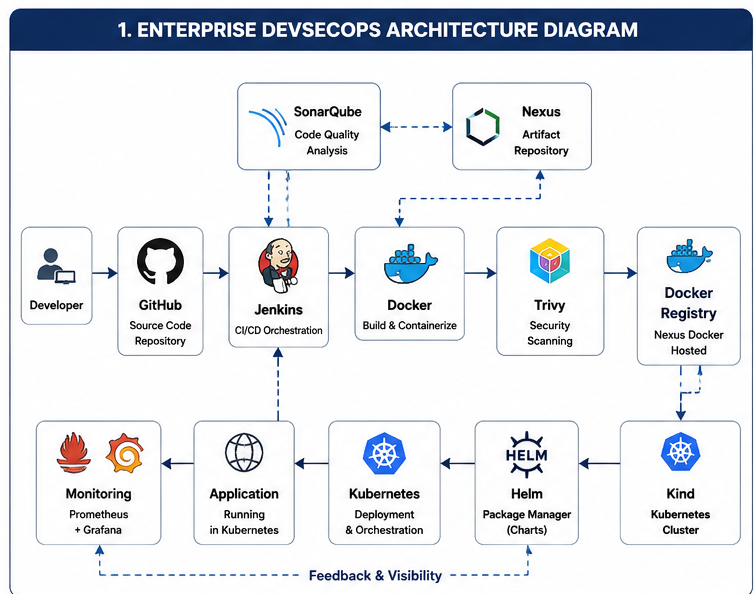
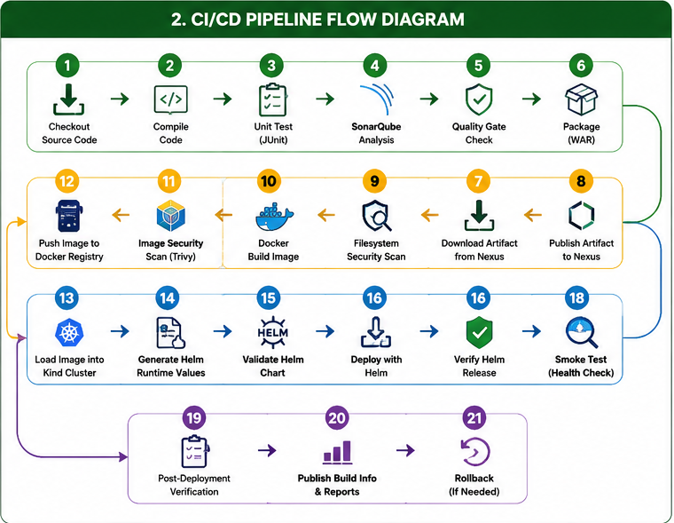
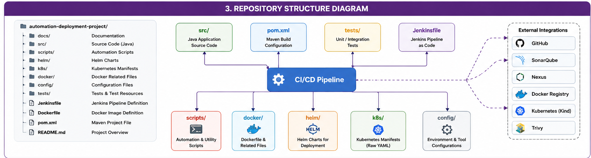

# Enterprise DevSecOps CI/CD Pipeline with Jenkins, SonarQube, Nexus, Docker, Kubernetes & Helm

## Overview

This repository demonstrates a complete Enterprise DevSecOps Continuous Integration and Continuous Deployment (CI/CD) pipeline built using industry-standard open-source technologies.

The pipeline automates the complete software delivery lifecycle—from source code checkout to secure deployment on Kubernetes—while integrating code quality analysis, artifact management, security scanning, containerization, Helm-based deployments, automated verification, and rollback support.

The project follows enterprise DevOps best practices including Pipeline as Code, Infrastructure as Code principles, modular automation scripts, and comprehensive deployment verification.

## Architecture

3. Tech Stack

| Category            | Technology                    |
|---------------------|-------------------------------|
| Language            | Java 17                       |
| Build Tool          | Maven                         |
| CI/CD               | Jenkins                       |
| Code Quality        | SonarQube                     |
| Artifact Repository | Nexus Repository              |
| Containerization    | Docker                        |
| Security            | Trivy, OWASP Dependency Check |
| Container Registry  | Nexus Docker Hosted           |
| Orchestration       | Kubernetes (Kind)             |
| Package Manager     | Helm                          |
| Operating System    | Ubuntu WSL2                   |
| Scripting           | Bash                          |

## Pipeline

## Project Status

| Component                 | Status      |
|---------------------------|-------------|
| Jenkins CI/CD             | ✅ Complete |
| SonarQube Integration     | ✅ Complete |
| Nexus Repository          | ✅ Complete |
| Docker Build & Push       | ✅ Complete |
| Trivy Security Scan       | ✅ Complete |
| OWASP Dependency Check    | ✅ Complete |
| Kubernetes Deployment     | ✅ Complete |
| Helm Deployment           | ✅ Complete |
| Runtime Values Generation | ✅ Complete |
| Smoke Testing             | ✅ Complete |
| Release Verification      | ✅ Complete |
| Rollback Support          | ✅ Complete |

## Features

- Jenkins Pipeline as Code
- SonarQube Code Quality Analysis
- Nexus Artifact Management
- WAR Artifact Publishing
- Docker Image Build & Push
- Trivy Security Scanning
- OWASP Dependency Check
- Kubernetes Deployment
- Helm-based Release Management
- Runtime Helm Values Generation
- Automated Deployment Verification
- Smoke Testing
- Rollback Support
- Modular Automation Scripts

## Repository Structure

## Quick Start

git clone https://github.com/muralidhargurram39/automation-deployment-project.git

cd automation-deployment-project

mvn clean package

docker compose up -d

Run Jenkins Pipeline

## Documentation

Detailed implementation guides are available in the `docs/` directory.

Documentation includes:

- Project Overview
- Installation Guide
- Jenkins Setup
- Nexus Setup
- SonarQube Setup
- Docker Setup
- Kubernetes Setup
- Helm Setup
- Pipeline Stages
- Script Reference
- Commands Reference
- Troubleshooting
- Lessons Learned

## Future Enhancements

- Argo CD GitOps
- Prometheus Monitoring
- Grafana Dashboards
- Alertmanager
- Terraform
- AWS EKS Deployment
- Blue/Green Deployment
- Canary Deployment

## Author

**Muralidhar G**

Enterprise DevOps | DevSecOps | Kubernetes | Cloud Automation

